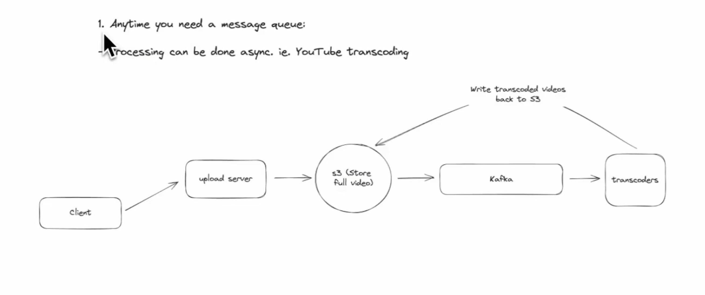
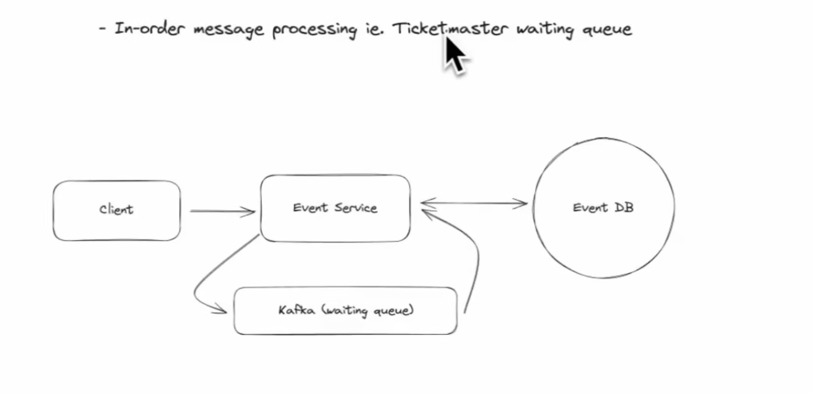
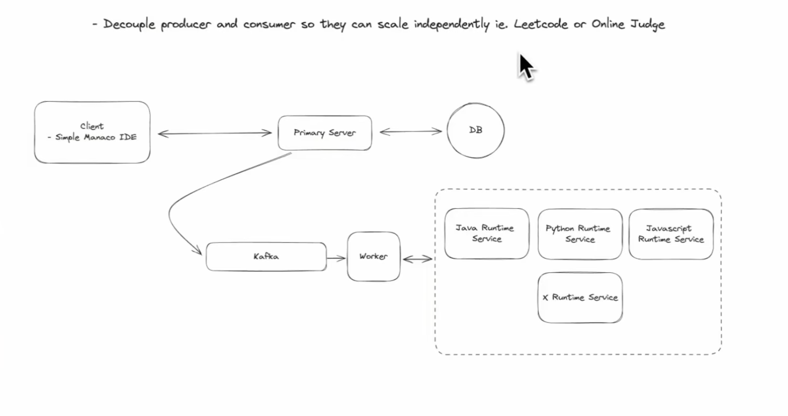
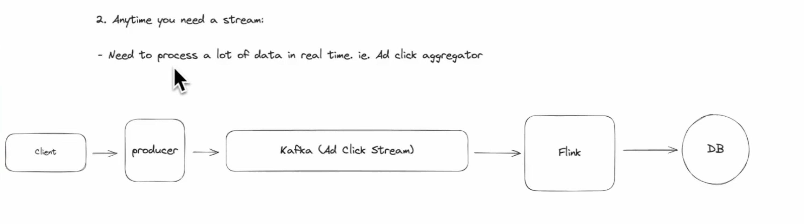
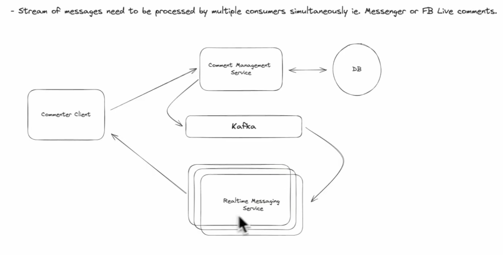

- Always remember the nuances between Queueing and Braodcasting(Event streaming).
- Event Streming(Kafka), vs Task processing(SQS)

- SQS follows competing consumers model.
    - When multiple consumers listening to the same queue, only one of them receives the message.
    - Hence SQS is great for Parallel job processing.
    - This is a classic example of load balancing and not broadcasting.
    -  This is why SQS is NOT Event Streaming.

- Kafka follows Event Drive Architecture(EDA).
    - Common usecases:
    - Event-Driven Microservices
    - Real-Time Data Streaming
    - Log Aggregation & Centralized Logging
    - Change Data Capture (CDC) From Databases
    - Stream Processing (Kafka + Flink / Spark)
    - Event Sourcing: 
        - Instead of storing the latest state, you store every change as an immutable event. The current state is rebuilt by replaying all past events. (Bank balance)
    - Metrics Collection & Monitoring

- Kafka
    - Topic 1
        - Partition 1
        - Partition 2
        - ...
    - Topic 2
        - Partition 1
        - Partition 2
        - ...
    
    - Consumer groups
        - Within a consumer group, a partition can be consumed by exactly ONE consumer.
        - No two consumers in the same group can read the same partition.
        - kafka mains the commit ID for each partition.

- Kafka Componenets
    - $Record$
        - Headers
        - Key
        - Value
        - Timestamp

## SQS - Competing consumers model

Multiple listeners (consumers) can listen to the same SQS queue — but each message will be delivered to only one of them. This is called the **competing consumers model**.  

It is not fan-out like Kafka.

## Hence, SQS is good of achieving parallel job processing

## When is kafka Needed?
  

  

  

  

   

